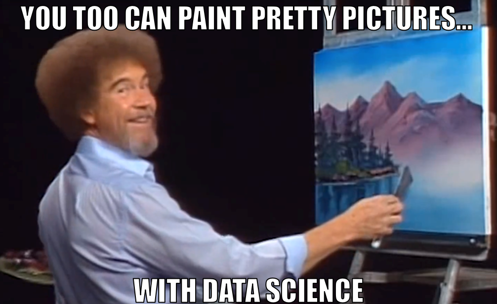

```{r setup, include=FALSE}
knitr::opts_chunk$set(echo = FALSE, warning = FALSE, message = FALSE)
```

In its raw form, data is completely unintelligible -- it's just a bunch of numbers, and our brains aren't really good at juggling a bunch of numbers. But our brains are *extremely* good at seeing patterns in visual images. Well-crafted data visualizations take advantage of that fact to communicate lots of information in an aesthetically pleasing way. 



This week, we start building our own visualizations using the `ggplot2` package (a part of the `tidyverse`). It will take some time to learn all of the function syntax, so be patient with yourself. Once you get the hang of it, you'll have an endlessly flexible tool for exploring and communicating patterns in your data. Let's get started.

## Reading Assignments

Before next week, please read and annotate the following:

- [Healy Chapter 3](https://socviz.co/makeplot.html)
- [Healy Chapter 4](https://socviz.co/groupfacettx.html)

## Team Project

Locate the file `R/week-02/team-project-1.Rmd` in our code repository. Open it, complete the instructions therein, and submit to eLC by class on Monday.