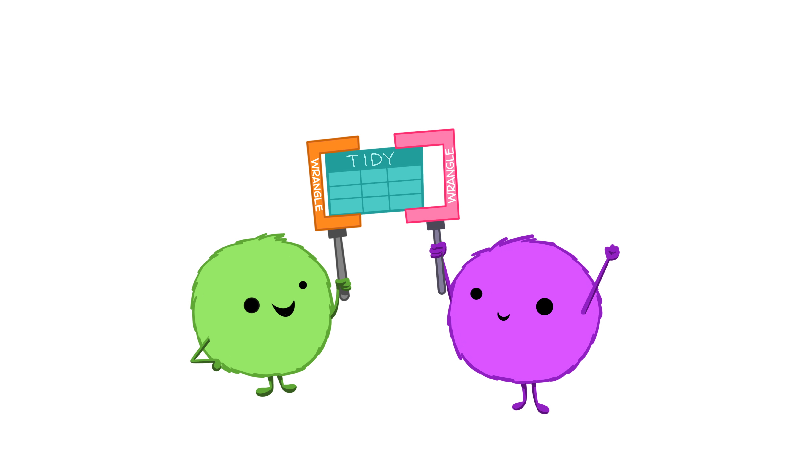

```{r setup, include=FALSE}
knitr::opts_chunk$set(echo = FALSE, warning = FALSE, message = FALSE)
```

This week, we talk about **merging** data from multiple sources. Also there's a quiz.




## Reading Assignments

No new reading assignments this week! Take the time to catch up on anything you missed.


## Team Project

Read over the CES codebook and pick some survey questions you find interesting. Modify `R/week-04-clean-ces-2020` to clean up and include those variables, and create a new data visualization. Your visualization should be pretty, easy to understand, and tell an interesting story! Submit your image and the R script that produced it to eLC.