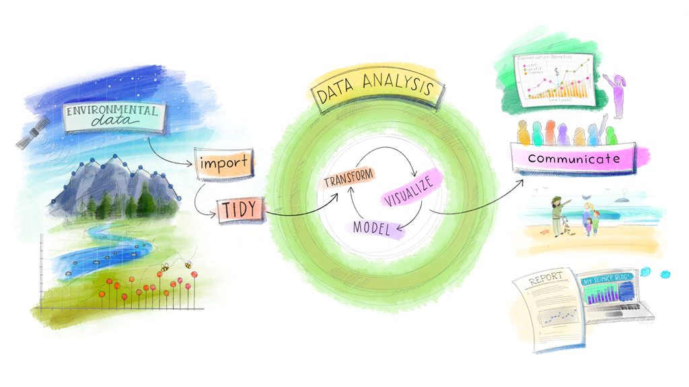

```{r setup, include=FALSE}
knitr::opts_chunk$set(echo = FALSE, warning = FALSE, message = FALSE)
```

This week, we review the entire data analysis pipeline from start to finish: how to find the data, import it, clean it up, summarize it, and build a visualization.



If you're looking for additional practice with the skills we've learned over the past five weeks, I highly recommend the [RStudio primers](https://rstudio.cloud/learn/primers), a set of interactive online tutorials. To review the functions we've covered so far, check out "The Basics", "Work With Data", "Visualize Data", and "Tidy Your Data". The other primers are more advanced `R` functions -- you may try them if you're looking for an extra challenge. 


## Reading Assignments

Next week, we start making maps! Before then, please read:

- [Healy Chapter 7](https://socviz.co/maps.html)


## Team Project

Reproduce Figure 1.8 (or Figure 1.9, your choice) from [Chapter 1](https://socviz.co/lookatdata.html) of the Healy book. You can ignore the shaded confidence interval, but add six countries not included in the original plot.[^fn1] Write a report in RMarkdown including your chart, and submit the report to eLC as a knitted PDF. 

To get PDF knitting working, first enter these two commands into your RStudio console:

```
install.packages('tinytex')
tinytex::install_tinytex()
```


[^fn1]: I want to know what this trend looks like in, for example, non-democratic countries! 