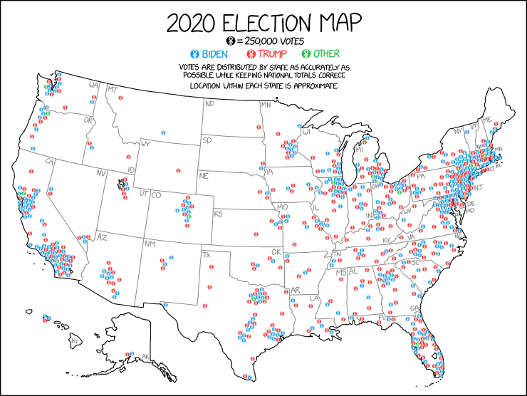

```{r setup, include=FALSE}
knitr::opts_chunk$set(echo = FALSE, warning = FALSE, message = FALSE)
```

This week, we'll learn to draw maps to represent geographic data with `ggplot`. We'll discuss both the code you need and the aesthetic choices you should be aware of when working with spatial data.

[](https://xkcd.com/2399/large/)


## Reading Assignments

Next week, we play with interactive maps using the `leaflet` package. Before then, please read:

- [Introduction to Leaflet](https://rstudio.github.io/leaflet/)
- [The Map Widget](https://rstudio.github.io/leaflet/map_widget.html)
- [Using Basemaps](https://rstudio.github.io/leaflet/basemaps.html)
- [Adding Markers](https://rstudio.github.io/leaflet/markers.html)
- [Colors](https://rstudio.github.io/leaflet/colors.html)
- [Legends](https://rstudio.github.io/leaflet/legends.html)
- [Choropleths](https://rstudio.github.io/leaflet/choropleths.html)


## Team Project

Draw a map with `R` illustrating some interesting data. Anything you choose. If you need ideas, consider:

1. A state-level map of answers to a question in the Cooperative Election Study 2020.

2. A world map of answers to a question in the World Values Survey.

3. A county-level map of COVID-19 infections from the NYT repository.